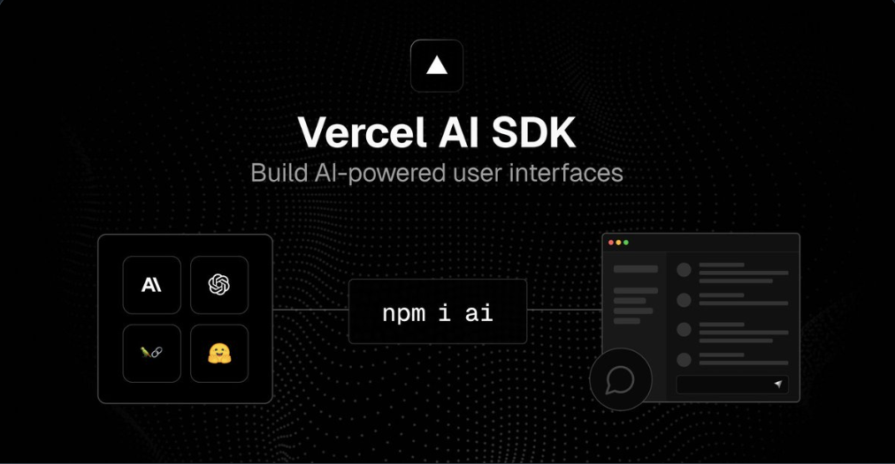

# Vercel-AI-SDK-Projects



## 📌 About This Repository

This repository is created to **practice and experiment with the Vercel AI SDK**, focusing mainly on building **multi-agent systems**.

I will be continuously pushing different projects built using the **Vercel AI SDK** as part of my learning journey. The goal is to keep all practice projects in one place so others can **explore, clone, and learn** from them as well.

## 🤖 Tech Stack

- **Vercel AI SDK**
- **Groq API** (used as the LLM provider)
- JavaScript / TypeScript (depending on the project)

## 🔑 Groq API Key

This repository uses the **Groq API**, which is free and easy to use.

You can generate your API key here:  
👉 https://console.groq.com/keys

After getting your key, create a `.env` file in the project root and add:

```env
GROQ_API_KEY=your_api_key_here
